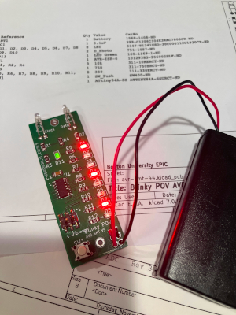

# blinky-avr-smt

## Blinky POV soldering project

This is a soldering practice kit which displays a message in the air
on LEDs when waved back and forth.  

* Programming: https://ohm.bu.edu/~hazen/BlinkyPovAVR/prog/test_prog.html
  
